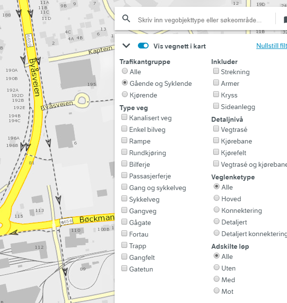
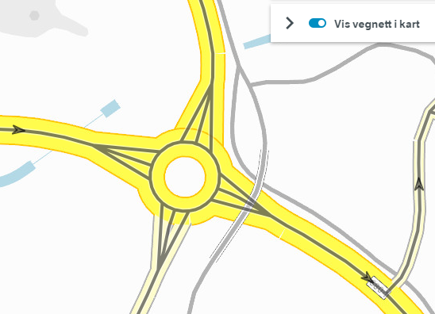
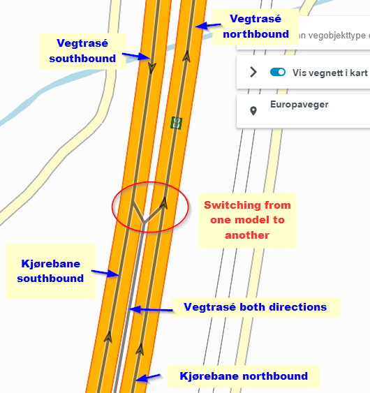

# Road network  

The NVDB road network is combined with NVDB feature types in a wide range of applications and products. You may utilize a pre-made product, query the NVDB api, or use the "show network" toggle switch in [Vegkart version 3](./vegkart.md). 

## For route planning and navigation

The NVDB road network and relevant feature types (such as restrictions and speed limits) are joined into products suitable for route planning. These products are equivalent, but not identical. They are updated approximately 10 times each year. 

### Elveg and Elveg 2.0 

Elveg has been the official route planning product since mid-1990's, although with several modifications. The format is [Norwegian SOSI](https://www.kartverket.no/en/geodataarbeid/SOSI-Standard-in-English/SOSI-Standard-in-English/). Elveg is distributed through the Norwegian mapping authority [metadata and distribution portal](https://kartkatalog.geonorge.no/?text=elveg). 

From 2020, the major revised Elveg 2.0 can be downloaded as GML through the Norwegian mapping authority [metadata and distribution portal](https://kartkatalog.geonorge.no/?text=elveg). A test version of Elveg 2.0 can be downloaded from December 2020. 

### Data for NVDB route planning application

The Norwegian Road Administration willingly shares the road network data that we use in our own route planning application. For historical reasons, we've had to produce these data in both esri file geodatabase and spatiaLite formats. At some point, we will scrap support for the esri file geodatabase. There is some rather [crude and rudimentary documentation here](https://www.vegdata.no/2013/08/08/hvor-finner-jeg-vegnettsdata-til-navigasjon/). 

Currently, we publish these data through two parallell channels: 
  * The Norwegian Mapping authority [metadata and distribution channel](https://kartkatalog.geonorge.no/metadata?text=ruteplan)
  * Our [FTP server](ftp://vegvesen.hostedftp.com/~StatensVegvesen/vegnett/) 

We've had some minor quirks with the first one, as soon as we feel confident the quirks are gone for good we'll drop support for ftp. 

# NVDB api links and link sequences

In NVDB, the road network is defined through a combination of link sequences, links, nodes and ports. Not all of these details are relevant for every applications. The links alone are plenty for most, but not all use cases. 

**Veglenkesekvens = Link sequence** are a-historic (i.e. never expire), and have a linear reference system that always starts at 0 and ends at 1. New link sequences are added as needed, but they never expire. 

**Veglenker = Links** belong to a link sequence, but can evolve over time. As the road network evolves, the links are typically cut into smaller pieces or are  replaced by other (usually shorter) links. But expired doesn't mean deleted - we preserve this part of history, so you can go back in time and see what the network was then. Todays active road network is the subset of links with `start date < today < expiry date`. Links obey the linear reference of the link sequence they belong to, i.e. their start and end position is between 0 and 1, `0 <= start position <= end position <= 0`. 

Think of link sequences as a list of links, and some of those links may be expired (but not deleted). 

Links are connected through [nodes](https://nvdbapilesv3.docs.apiary.io/#reference/0/vegnett-noder/vegnett-noder). Technically, this connection goes through a port - but this level of detail is usually not nescessary for proper use of road network data. 

**The link sequence ID combined with the non-dimmensional linear reference system** (i.e. a number between 0-1) gives you a **persistent, permanent reference to the road network of NVDB**. This reference may point to an expired link, meaning that the road has been physically replaced, but the reference is still valid. 

### Topology levels 

NVDB has three different topology levels, but not everywhere in the network: The more detailed levels are added as needed. 

  * Vegtrasé = Overview. This is your typically road center line. A road where the traffic flow in both directions runs adjacent to each other is usually adequately described with this level alone - even if that road has many lanes.  
  * Kjørebane = Roadway. Sometimes, we need to augment vegtrasé with more detailed network. 
  * Kjørefelt = Lane. Used to supplement the vegtrasé with another level of detail. 

Close to the roundabout, we need to supplement the _vegtrasé_ level with links at the _kjørebane_ level. That's why there are three links connecting each road to the roundabout: Two _kjørebane_ links and one _vegtrasé_ link. This enables different users to tailor their level of detail to their use case. 

### The raw stuff: /vegnett/veglenkesekvenser

[https://www.vegvesen.no/nvdb/api/v3/vegnett/veglenkesekvenser/](https://www.vegvesen.no/nvdb/api/v3/vegnett/veglenkesekvenser/)

[https://www.vegvesen.no/nvdb/api/v3/vegnett/veglenkesekvenser/<ID>](https://www.vegvesen.no/nvdb/api/v3/vegnett/veglenkesekvenser/20000)

This end point exposes you to the beautifull detail of links, nodes and ports (though nodes and ports can be ignored for many use cases). 

