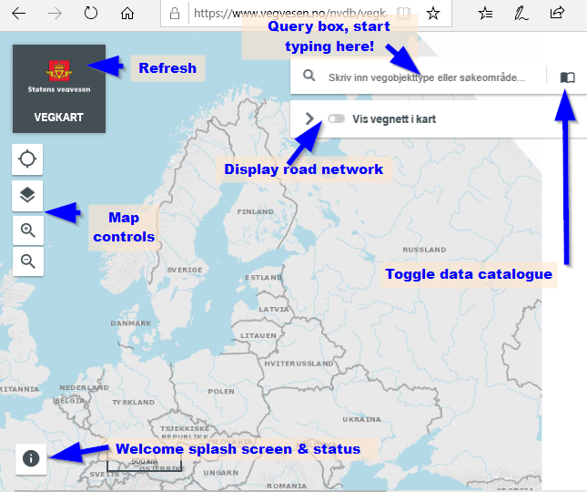
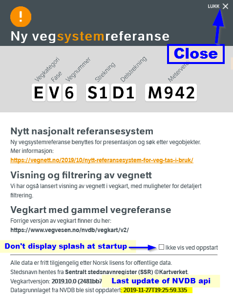
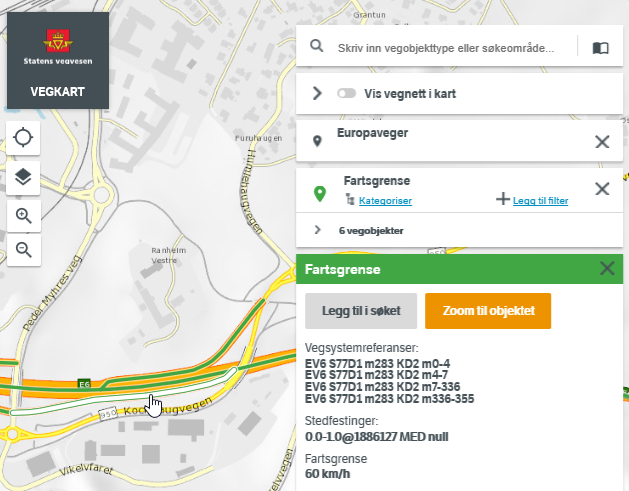
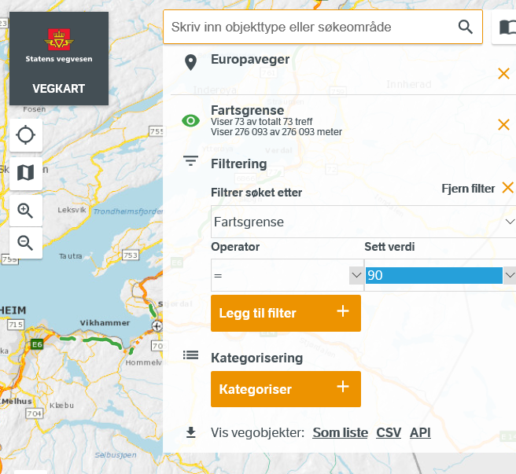
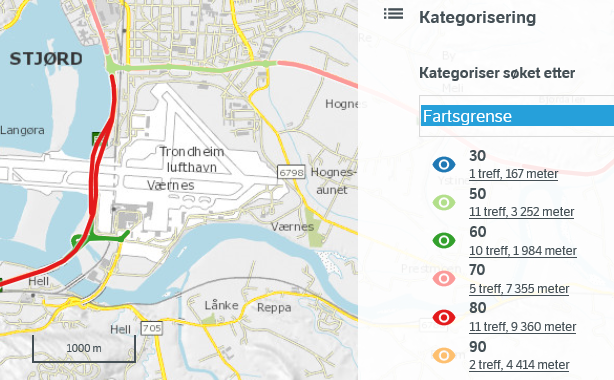

# Vegkart 

[Vegkart](https://www.vegvesen.no/nvdb/vegkart/v3) is the tool for learning and browsing NVDB data and road network. For many  use cases the CSV download utility is sufficient, but Vegkart is also an excellent starting point for learning how to build API queries. 

  * [Version 3 of Vegkart](https://www.vegvesen.no/nvdb/vegkart/v3) is still under development, and some advanced features are lacking. The most important change from V2 is 
    * A major revision of the [road reference system](./konsept4_roadreference.md)
    * After 1st January 2020, the new administrative areas _fylke_ (region) and _kommune_ (municipality) will be enforced
  * [Version 2 of Vegkart](http://vegkart.no) will remain avialable untill August 2021 - with the old [road reference system](./konsept4_roadreference.md) and administrative areas according to the year 2019. 

### Vegkart main components 

  * **Map canvas** - which also is a geographic filter, so zooming and panning will affect the results. _(This can be overruled by adding the name of specific geographic areas of interest to the query box)_. The map is interactive: Clicking on a road will display road number and other [road reference info](./konsept4_roadreference.md), and clicking on a feature will display info about the feature. 
  * Clicking **our logo** will refresh everything. 
  * **Map controls**. Zoom, change background map, center on position. Vegkart also support mouse wheel zoom, SHIFT-click-and-drag zoom and click-and-drag panning.  
  * **Display road network** toggles the display of NVDB road network links with direction. 
  *  **Query box**. This is the heart of Vegkart, with loads of filtering and quering options, including but not limited to road number, municipality and name of feature type. 
  * **Show data catalogue** toggle switch will transform the query box into [data catalogue browser](./konsept2_datakatalog.md).  
  * **info** (opens the welcome splash screen). 
 


### The welcome splash screen 

The welcome splash screen is used to convey important information about NVDB. Beginning in 2020, we change the [road reference system](./konsept4_roadreference.md), which is why the splash screen has a summary about this transition, with relevant links. We also display licencing information, vegkart version and the last time NVDB api was updated. 

Below, we have highlighted how to close the splash screen and how to prevent it from opening every time you open Vegkart. 



# Practical example

Searching for speed limits (fartsgrense) on the most important road category (europaveger) by typing into the query box: 
```
fartsgrense
europaveger
```  
Notice how autocomplete will guide you to the right termes. By and zooming in and clicking you should see something similar to: 



# Download functionality

By clicking the `6 vegobjekter` symbol you will be shown a list of the features matching your query:


At the bottom, you have two download options: 
  * Download CSV _(all data quoted by " and separated by semicolon ; and charset = latin1). **This functionality is under development for vegkart V3, please use [Vegkart V2](http://vegkart.no) while we fix this** 
  * A link to the exact API query that Vegkart has used to fetch data for you. _Vegkart is therefore an excellent starting point for learing how to use NVDB api._
  
# Filtering your query

The filtering functionality of Vegkart V3 is still under development, for advanced filtering please check [Version 2 of vegkart](http://vegkart.no)

_Legg til filter_ = add filter, _fjern filter_ = remove filter. 


  
# Color coding by attribute values

_Kategoriser_ = in this context, categorize by attribute value, i.e. draw each category with a different color. 

This feature is still under development in Vegkart V3, here we show an example of Vegkart V2: 

